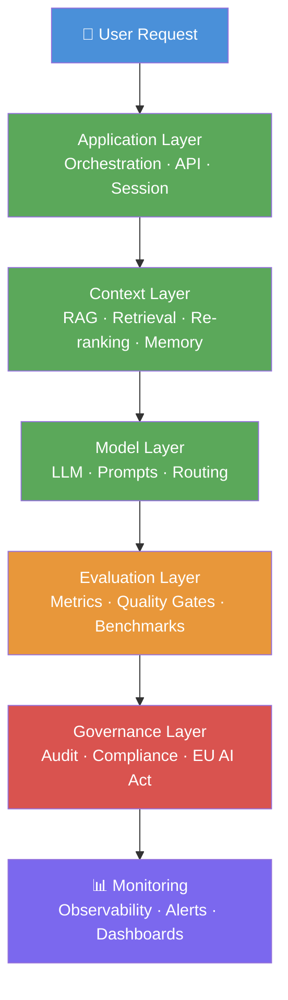
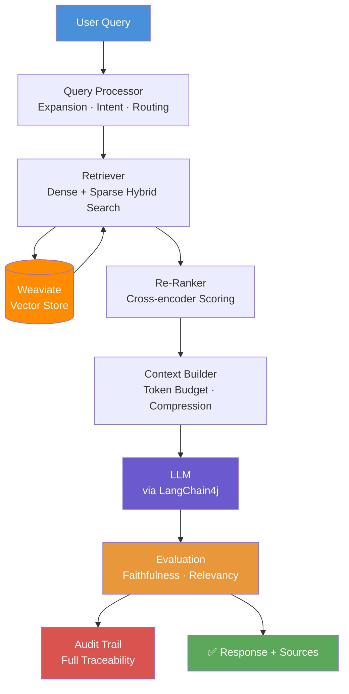
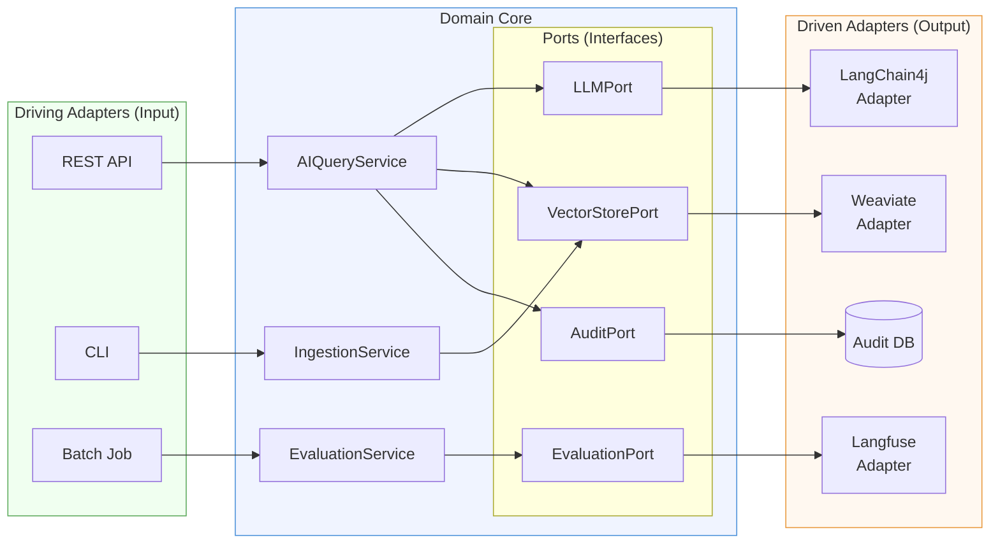
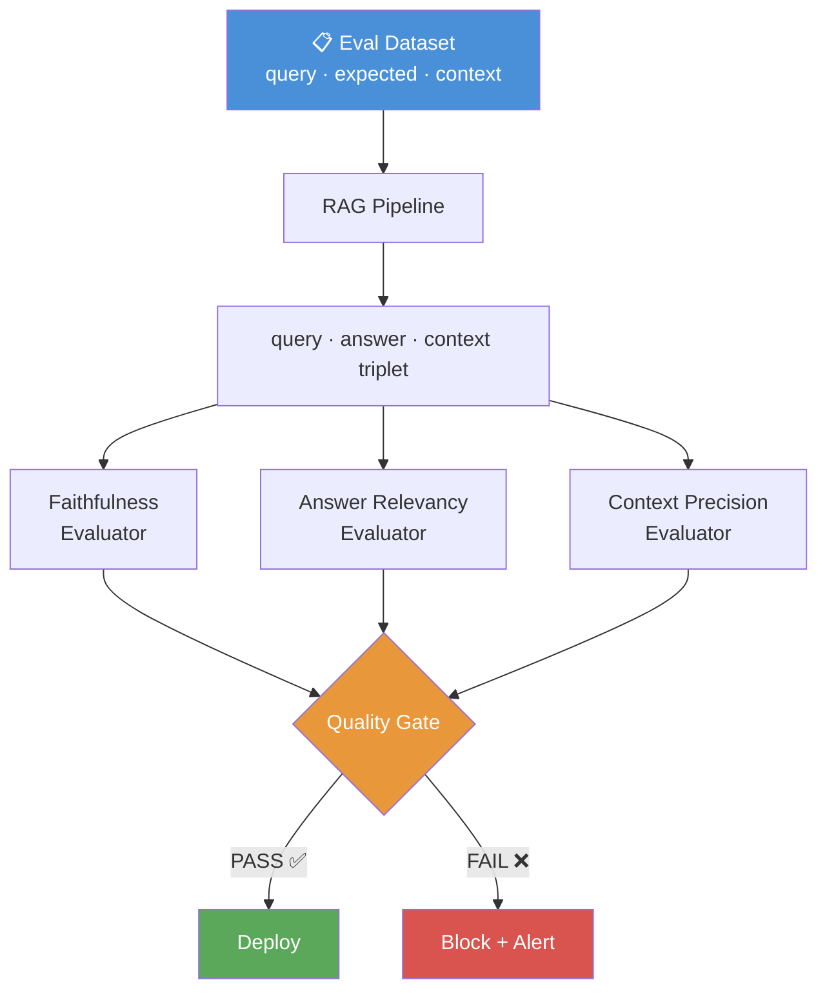
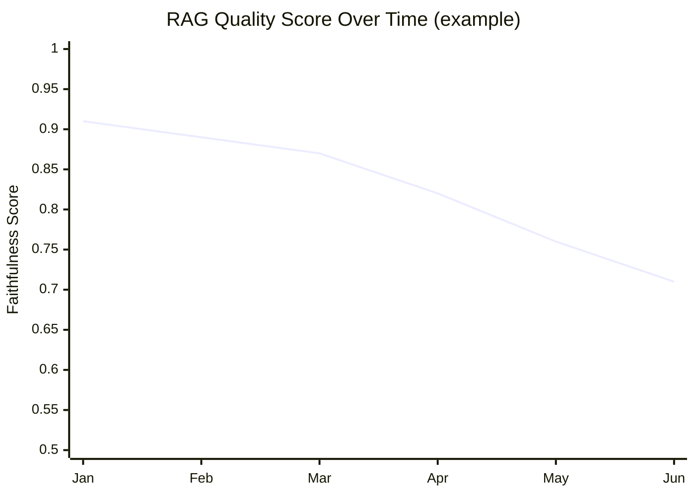
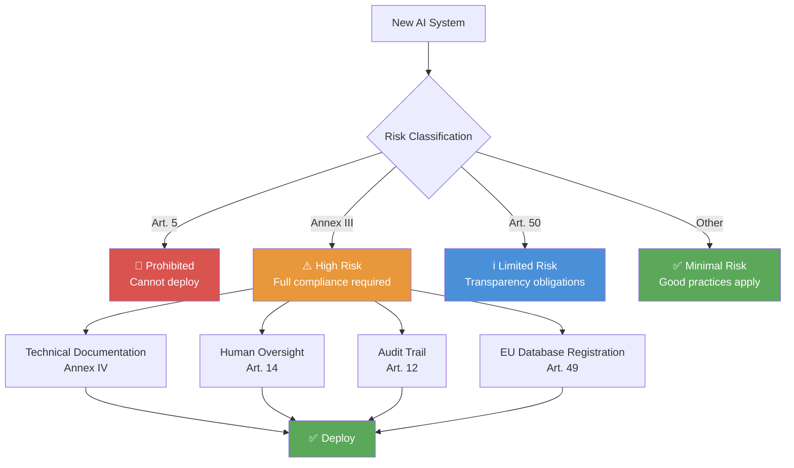

# Diagrams — Reliable Enterprise AI

> All architecture diagrams in Mermaid format. GitHub renders these natively.

---

## 1. The 5 Layers Framework

---

## 2. Reliable RAG Pipeline

---

## 3. Hexagonal Architecture for AI Systems

---

## 4. LLM Evaluation Pipeline

---

## 5. Knowledge Base Drift Over Time

---

## 6. EU AI Act Compliance Flow

---

## How to Use These Diagrams

All diagrams are in **Mermaid format** and render automatically on GitHub.

To use in your articles or presentations:
1. Copy the Mermaid code block
2. Paste into any Mermaid-compatible editor (mermaid.live)
3. Export as SVG or PNG for use in Medium, LinkedIn, or slides

> **These diagrams are the visual identity of Reliable Enterprise AI.**  
> Use them consistently across all content.
